# Laporan Resmi Praktikum Jarkom Modul 3 - Kelompok IT07

| Nama              | NRP        |
| ----------------- | ---------- |
| Muhammad Afif     | 5027221032 |
| Alma Amira Dewani | 5027221054 |

# Pendahuluan

Praktikum modul 2 jarkom terdiri dari 21 soal yang dikerjakan seluruhnya menggunakan `VM GNS3`. Ketentuan tambahannya adalah node debian untuk praktikum ini harus menggunakan docker image `danielcristh0/debian-buster:1.1`.

Berikut merupakan cara penyelesaian modul oleh kelompok IT07.

## No.0 dan 1

### Buat topologi sesuai soal

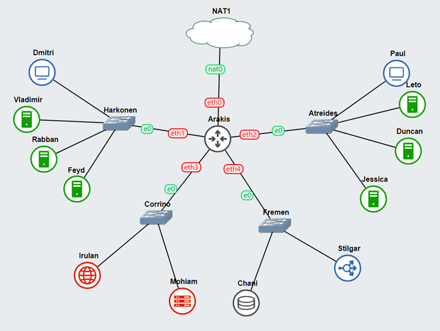

### konfigurasi tiap node

- Arakis (Router + DHCP Relay)
```
auto eth0
iface eth0 inet dhcp

# ke Harkonen
auto eth1
iface eth1 inet static
    address 10.67.1.1
    netmask 255.255.255.0

# ke Atreides
auto eth2
iface eth2 inet static
    address 10.67.2.1
    netmask 255.255.255.0

# ke Corrino
auto eth3
iface eth3 inet static
    address 10.67.3.1
    netmask 255.255.255.0

# ke Fremen
auto eth4
iface eth4 inet static
    address 10.67.4.1
    netmask 255.255.255.0
```

- Mohiam (DHCP Server)
```
auto eth0
iface eth0 inet static
    address 10.67.3.2
    netmask 255.255.255.0
    gateway 10.67.3.1
    up echo nameserver 192.168.122.1 > /etc/resolv.conf
```

- Irulan (DNS Server)
```
auto eth0
iface eth0 inet static
    address 10.67.3.3
    netmask 255.255.255.0
    gateway 10.67.3.1
    up echo nameserver 192.168.122.1 > /etc/resolv.conf
```

- Dmitri (Client)
```
auto eth0
iface eth0 inet dhcp
```

- Paul (Client)
```
auto eth0
iface eth0 inet dhcp
```

- Chani (Database Server)
```
auto eth0
iface eth0 inet static
    address 10.67.4.2
    netmask 255.255.255.0
    gateway 10.67.4.1
    up echo nameserver 192.168.122.1 > /etc/resolv.conf
```

- Stilgar (Load Balancer)
```
auto eth0
iface eth0 inet static
    address 10.67.4.3
    netmask 255.255.255.0
    gateway 10.67.4.1
    up echo nameserver 192.168.122.1 > /etc/resolv.conf
```

- Leto (Laravel Worker)
```
auto eth0
iface eth0 inet static
    address 10.67.2.2
    netmask 255.255.255.0
    gateway 10.67.2.1
    up echo nameserver 192.168.122.1 > /etc/resolv.conf
```

- Duncan (Laravel Worker)
```
auto eth0
iface eth0 inet static
    address 10.67.2.3
    netmask 255.255.255.0
    gateway 10.67.2.1
    up echo nameserver 192.168.122.1 > /etc/resolv.conf
```

- Jessica (Laravel Worker)
```
auto eth0
iface eth0 inet static
    address 10.67.2.4
    netmask 255.255.255.0
    gateway 10.67.2.1
    up echo nameserver 192.168.122.1 > /etc/resolv.conf
```

- Vladimir (PHP Worker)
```
auto eth0
iface eth0 inet static
    address 10.67.1.2
    netmask 255.255.255.0
    gateway 10.67.1.1
    up echo nameserver 192.168.122.1 > /etc/resolv.conf
```

- Rabban (PHP Worker)
```
auto eth0
iface eth0 inet static
    address 10.67.1.3
    netmask 255.255.255.0
    gateway 10.67.1.1
    up echo nameserver 192.168.122.1 > /etc/resolv.conf
```

- Feyd (PHP Worker)
```
auto eth0
iface eth0 inet static
    address 10.67.1.4
    netmask 255.255.255.0
    gateway 10.67.1.1
    up echo nameserver 192.168.122.1 > /etc/resolv.conf
```

### Konfigurasi script

Tambahkan baris berikut pada :

- Arakis (Router) - `.bashrc`
```bash
iptables -t nat -A POSTROUTING -o eth0 -j MASQUERADE -s 10.67.0.0/16
apt-get update
apt-get install isc-dhcp-relay -y
service isc-dhcp-relay start
```

- Irulan (DNS) - `init-script.sh`
```bash
apt-get update
apt-get install bind9 -y
```

- Mohiam (DHCP) - `init-script.sh`
```bash
apt-get update
apt-get install isc-dhcp-server -y
```

- Client - `init-script.sh`
```bash
apt-get update
apt-get install dnsutils apache2-utils lynx -y
```

### Konfigurasi DHCP Relay

Atur agar DHCP Relay (Arakis) mengarah ke DHCP Server (Mohiam) dan Interface nya terbuka untuk eth1 - eth4

- `/etc/default/isc-dhcp-relay`
```conf
SERVERS="10.67.3.2"  
INTERFACES="eth1 eth2 eth3 eth4"
OPTIONS=""
```

### Mendaftarkan domain atreides.it07.com dan harkonen.it07.com

Tambahkan zone `atreides.it07.com` dan `harkonen.it07.com` pada DNS Server (Irulan)

- `/etc/bind/named.conf.local`
```conf
zone "atreides.it07.com" {
	type master;
	file "/etc/bind/jarkom_it07/atreides.it07.com";
};

zone "harkonen.it07.com" {
	type master;
	file "/etc/bind/jarkom_it07/harkonen.it07.com";
};
```

Buat direktori `jarkom_it07` pada path `/etc/bind/`

```bash
mkdir /etc/bind/jarkom_it07
```

Kemudian buat file konfigurasi untuk masing-masing domain dengan ketentuan :

atreides.it07.com mengarah ke Laravel Worker `Leto`

- `/etc/bind/jarkom_it07/atreides.it07.com`
```conf
;
; BIND data file for local loopback interface
;
$TTL    604800
@       IN      SOA     atreides.it07.com. root.atreides.it07.com. (
                              2         ; Serial
                         604800         ; Refresh
                          86400         ; Retry
                        2419200         ; Expire
                         604800 )       ; Negative Cache TTL
;
@             IN      NS      atreides.it07.com.
@             IN      A       10.67.2.2 ; ini IP Leto
```

sementara harkonen.it07.com mengarah ke PHP Worker `Vladimir`

- `/etc/bind/jarkom_it07/harkonen.it07.com`
```conf
;
; BIND data file for local loopback interface
;
$TTL    604800
@       IN      SOA     harkonen.it07.com. root.harkonen.it07.com. (
                              2         ; Serial
                         604800         ; Refresh
                          86400         ; Retry
                        2419200         ; Expire
                         604800 )       ; Negative Cache TTL
;
@             IN      NS      harkonen.it07.com.
@             IN      A       10.67.1.2 ; ini IP Vladimir
```

## No.2

### Konfigurasi DHCP Server (Mohiam)

Setup Mohiam untuk menerima jaringan IpV4 dari eth0

- `/etc/default/isc-dhcp-server`
```conf
INTERFACES="eth0"
OPTIONS=""
```

Selain itu, atur juga konfigurasi DHCP Server untuk membatasi range IP `Harkonen`. IP memiliki jangkauan dari 10.67.1.14 hingga 10.67.1.28 dan dari 10.67.1.49 hingga 10.67.1.70

- `/etc/dhcp/dhcpd.conf`
```conf
subnet 10.67.3.0 netmask 255.255.255.0 {
    option routers 10.67.3.1;
    option broadcast-address 10.67.3.255;
}

subnet 10.67.4.0 netmask 255.255.255.0 {
    option routers 10.67.4.1;
    option broadcast-address 10.67.4.255;
}

# Konfigurasi untuk subnet Harkonen
subnet 10.67.1.0 netmask 255.255.255.0 {
    range 10.67.1.14 10.67.1.28;
    range 10.67.1.49 10.67.1.70;
    option routers 10.67.1.1;
    option broadcast-address 10.67.1.255;
    option domain-name-servers 192.168.122.1;
}
```

Hapus file dhcpd.pid lalu restart service

- `terminal`
```bash
rm /var/run/dhcpd.pid

service isc-dhcp-server restart
```

## No.3

### Menambahkan Konfigurasi DHCP Server (Mohiam)

Setelah menambahkan subnet untuk Harkonen, tambahkan pula subnet untuk Atreides dengan menambahkan baris baru pada `/etc/dhcp/dhcpd.conf` dengan range 10.67.2.15 hingga 10.67.2.25 dan 10.67.2.200 hingga 10.67.2.210

- `/etc/dhcp/dhcpd.conf`
```conf
# Konfigurasi untuk subnet Atreides
subnet 10.67.2.0 netmask 255.255.255.0 {
    range 10.67.2.15 10.67.2.25;
    range 10.67.2.200 10.67.2.210;
    option routers 10.67.2.1;
    option broadcast-address 10.67.2.255;
    option domain-name-servers 192.168.122.1;
}
```

## No.4

### Mengarahkan domain name server ke arah DNS Server

Pada config DHCP Server, ubah opsi `domain-name-servers` menjadi mengarah ke DNS Server (Irulan)

- `/etc/dhcp/dhcpd.conf`
```conf
# Konfigurasi untuk subnet Harkonen
subnet 10.67.1.0 netmask 255.255.255.0 {
    range 10.67.1.14 10.67.1.28;
    range 10.67.1.49 10.67.1.70;
    option routers 10.67.1.1;
    option broadcast-address 10.67.1.255;
    option domain-name-servers 10.67.3.3;
}

# Konfigurasi untuk subnet Atreides
subnet 10.67.2.0 netmask 255.255.255.0 {
    range 10.67.2.15 10.67.2.25;
    range 10.67.2.200 10.67.2.210;
    option routers 10.67.2.1;
    option broadcast-address 10.67.2.255;
    option domain-name-servers 10.67.3.3;
}
```

### Mengubah opsi pada DNS Server

Opsi bind pada DNS Server juga perlu diubah agar client tetap dapat terhubung ke internet

- `/etc/bind/named.conf.options`
```conf
options {
    listen-on-v6 { none; };
    directory "/var/cache/bind";

    # Forwarders
    forwarders {
        192.168.122.1;
    };

    forward only;

    dnssec-validation no;

    auth-nxdomain no;
    allow-query { any; };
};
```

### Menguji pada client

Jalankan perintah `ifconfig` pada client, nilai inet pada eth0 akan sesuai dengan IP yang sudah kita mapping sebelumnya

Lakukan **ping** pada `atreides.it07.com` dan `harkonen.it07.com`, terkadang responsenya akan datang cukup lama,

namun untuk memastikan bahwa sudah bisa terhubung pada DNS server, lakukan **nslookup** pada `atreides.it07.com` dan `harkonen.it07.com` lalu pastikan bahwa address dari masing masing domain sesuai dengan yang telah dikonfigurasi pada DNS Server.

## No.5

### Mengonfigurasi Leasing Times untuk Subnet Harkonen dan Atreides

Tambahkan lease time pada kedua konfigurasi subnet client dengan ketentuan:

| Client       | Default           | Max               |
| ------------ | ----------------- | ----------------- |
| Harkonen     | 5 menit (300 s)   | 87 menit (5220 s) |
| Atreides     | 20 menit (1200 s) | 87 menit (5220 s) |

- `/etc/dhcp/dhcpd.conf`
```conf
# Konfigurasi untuk subnet Harkonen
subnet 10.67.1.0 netmask 255.255.255.0 {
    range 10.67.1.14 10.67.1.28;
    range 10.67.1.49 10.67.1.70;
    option routers 10.67.1.1;
    option broadcast-address 10.67.1.255;
    option domain-name-servers 10.67.3.3;
    default-lease-time 300;
    max-lease-time 5220;
}

# Konfigurasi untuk subnet Atreides
subnet 10.67.2.0 netmask 255.255.255.0 {
    range 10.67.2.15 10.67.2.25;
    range 10.67.2.200 10.67.2.210;
    option routers 10.67.2.1;
    option broadcast-address 10.67.2.255;
    option domain-name-servers 10.67.3.3;
    default-lease-time 1200;
    max-lease-time 5220;
}
```

## No.6

### Menginstal keperluan pada PHP Worker

Untuk menjalankan website PHP pada worker, maka keperluan berikut perlu diinstal pada setiap worker PHP (`Vladimir`, `Rabban`, dan `Feyd`)

- `terminal`
```bash
apt-get update
apt-get install nginx wget unzip php7.3 php-fpm -y
```

Nantinya website ini akan dijalankan menggunakan PHP 7.3 dan web server nginx

Website yang dimaksud senndiri terdapat pada [link berikut](https://drive.google.com/file/d/1lmnXJUbyx1JDt2OA5z_1dEowxozfkn30/view).

- `terminal`
```bash
wget --no-check-certificate 'https://docs.google.com/uc?export=download&id=1lmnXJUbyx1JDt2OA5z_1dEowxozfkn30' -O 'harkonen.zip'
unzip harkonen.zip

# meletakkan komponen web
mkdir -p /var/www/jarkom_it07
mv /root/modul-3/* /var/www/jarkom_it07/

# menghapus hasil download
rmdir /root/modul-3
rm harkonen.zip
```

### Konfigurasi Web Server

Web server yang sudah diinstal dan Komponen web yang sudah didownload perlu dikonfigurasikan agar dapat dijalankan dan diakses oleh client.

Dibuat file konfigurasi baru pada `/etc/nginx/sites-available/` dengan nama `jarkom_it07.conf`

- `/etc/nginx/sites-available/jarkom_it07.conf`
```conf
server {
    listen 80;

    server_name _;

    root /var/www/jarkom_it07;
    index index.php index.html index.htm;
    
    location / {
        try_files $uri $uri/ /index.php?$query_string;
    }

    location ~ \.php$ {
        include snippets/fastcgi-php.conf;
        fastcgi_pass unix:/var/run/php/php7.3-fpm.sock;
    }

    error_log /var/log/nginx/jarkom_it07_error.log;
    access_log /var/log/nginx/jarkom_it07_access.log;
}
```

Restart service nginx lalu periksa hasilnya dengan mengaksesnya melalui client

## No.7

### Menginstal Keperluan pada Load Balancer

Instal keperluan pada Stilgar (Load Balancer)

- `terminal`
```
apt-get update
apt-get install nginx -y
```

### Konfigurasi Load Balancer

Secara default, load balancer yang digunakan pada nginx adalah load balancer dengan metode `Round Robin`. Konfigurasi dilakukan dengan membuat file konfigurasi baru pada `/etc/nginx/sites-available/`, isinya adalah seperti berikut:

- `/etc/nginx/sites-available/round_robbin_3w.conf`
```conf
upstream round_robin_3w  {
    server 10.67.1.2; #Vladimir
    server 10.67.1.3; #Rabban
    server 10.67.1.4; #Feyd
}

server {
    listen 8000;
        location / {
            proxy_pass http://round_robin_3w;
            proxy_set_header    X-Real-IP $remote_addr;
            proxy_set_header    X-Forwarded-For $proxy_add_x_forwarded_for;
            proxy_set_header    Host $http_host;
        }

    error_log /var/log/nginx/loadb_error.log;
    access_log /var/log/nginx/loadb_access.log;
}
```

Aktifkan konfigurasi tersebut lalu restart service nginx

```bash
ln -s /etc/nginx/sites-available/round_robbin_3w.conf /etc/nginx/sites-enabled/round_robbin_3w

service nginx restart
```

Lakukan pengujian menggunakan apache benchmark pada tujuan ip load balancer dengan port 8000

```bash
ab -n 5000 -c 150 http://10.67.4.3:8000/
```

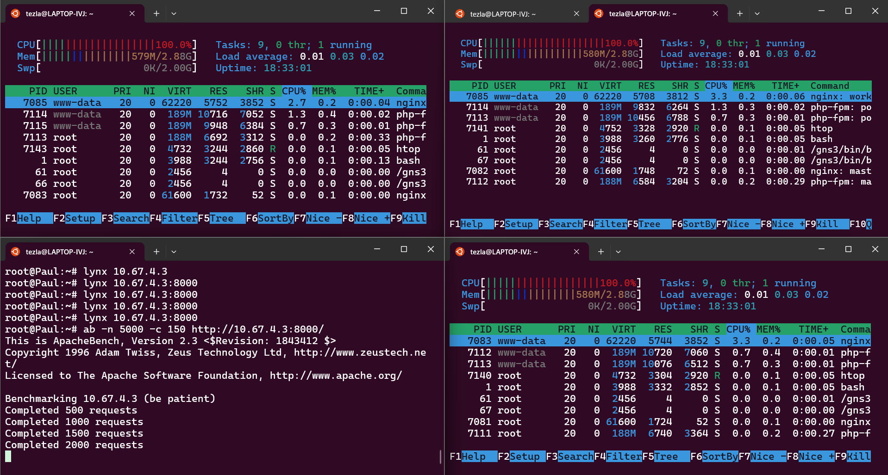

Hasil yang didapat

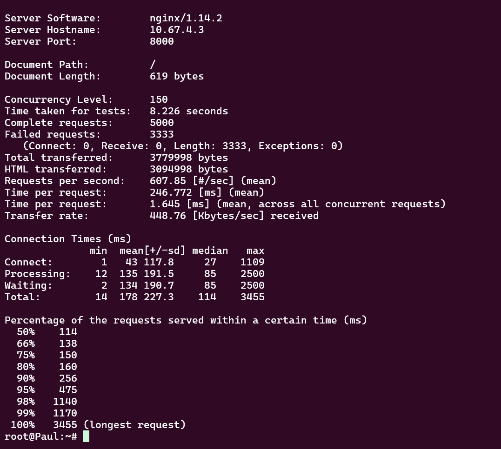

## No.8

### Membuka Port Load Balancer

Untuk memudahkan pengujian, maka dibuka beberapa port baru pada load balancer dengan setiap port memiliki metode load balancing yang berbeda

Sehingga Hasil akhirnya akan menajdi seperti berikut

| Port     | Method             | Worker(s) |
| -------- | ------------------ | --------- |
| 8000     | Round Robin        | 3 Workers |
| 8001     | IP Hash            | 3 Workers |
| 8002     | Generic Hash       | 3 Workers |
| 8003     | Least Conenction   | 3 Workers |

Untuk setiap metode, maka dibuatlah file konfigurasi baru

- `/etc/nginx/sites-available/ip_hash_3w.conf`
```conf
upstream ip_hash_3w  {
    ip_hash;
    server 10.67.1.2; #Vladimir
    server 10.67.1.3; #Rabban
    server 10.67.1.4; #Feyd
}

server {
    listen 8001;

        location / {
            proxy_pass http://ip_hash_3w;
            proxy_set_header    X-Real-IP $remote_addr;
            proxy_set_header    X-Forwarded-For $proxy_add_x_forwarded_for;
            proxy_set_header    Host $http_host;
        }

    error_log /var/log/nginx/loadb_error.log;
    access_log /var/log/nginx/loadb_access.log;
}
```

- `/etc/nginx/sites-available/gen_hash_3w.conf`
```conf
upstream gen_hash_3w  {
    hash $request_uri consistent;
    server 10.67.1.2; #Vladimir
    server 10.67.1.3; #Rabban
    server 10.67.1.4; #Feyd
}

server {
    listen 8002;

        location / {
            proxy_pass http://gen_hash_3w;
            proxy_set_header    X-Real-IP $remote_addr;
            proxy_set_header    X-Forwarded-For $proxy_add_x_forwarded_for;
            proxy_set_header    Host $http_host;
        }

    error_log /var/log/nginx/loadb_error.log;
    access_log /var/log/nginx/loadb_access.log;
}
```

- `/etc/nginx/sites-available/least_conn_3w.conf`
```conf
upstream least_conn_3w  {
    least_conn;
    server 10.67.1.2; #Vladimir
    server 10.67.1.3; #Rabban
    server 10.67.1.4; #Feyd
}

server {
    listen 8003;

        location / {
            proxy_pass http://least_conn_3w;
            proxy_set_header    X-Real-IP $remote_addr;
            proxy_set_header    X-Forwarded-For $proxy_add_x_forwarded_for;
            proxy_set_header    Host $http_host;
        }

    error_log /var/log/nginx/loadb_error.log;
    access_log /var/log/nginx/loadb_access.log;
}
```

### Pengujian menggunakan Script

Dibuat bash script yang dapat memudahkan pengujian, script dapat diakses [di sini](./scripts/LB-test.sh)

Saat script dijalankan, pilih `Multi Test - By LB Method` dan masukkan jumlah request beserta concurrency nya.

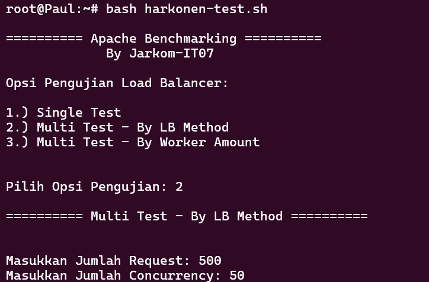

Kemudian didapat hasil seperti berikut

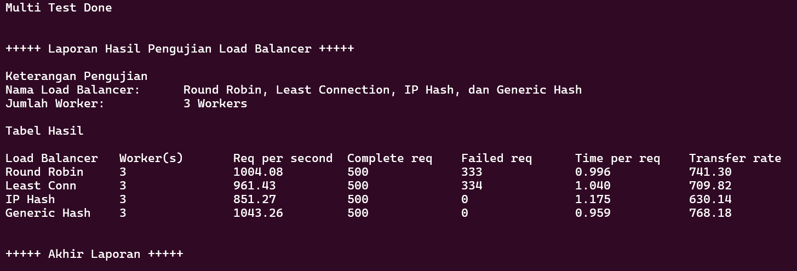

Hasil lengkapnya dapat diakses pada path `/root/report/`

Analisis kemudian dilakukan pada hasil tersebut untuk kemudian dibuat laporan yang dapat diakses melalui [link berikut]()

## No.9

### Membuka Port Load Balancer

Sama seperti sebelumnya, untuk memudahkan pengujian, maka dibuka beberapa port baru pada load balancer dengan setiap port memiliki jumlah worker yang berbeda

Sehingga hasil akhirnya akan menajdi seperti berikut

| Port     | Method             | Worker(s) |
| -------- | ------------------ | --------- |
| 8003     | Least Conenction   | 3 Workers |
| 8004     | Least Conenction   | 2 Workers |
| 8005     | Least Conenction   | 1 Workers |

Untuk setiap jumlah, maka dibuatlah file konfigurasi baru. Karena least connection dengan 3 worker telah berjalan, maka hanya perlu menambah dua konfigurasi lagi

- `/etc/nginx/sites-available/least_conn_2w.conf`
```conf
upstream least_conn_2w  {
    least_conn;
    server 10.67.1.2; #Vladimir
    server 10.67.1.3; #Rabban
    #server 10.67.1.4; #Feyd
}

server {
    listen 8004;

        location / {
            proxy_pass http://least_conn_2w;
            proxy_set_header    X-Real-IP $remote_addr;
            proxy_set_header    X-Forwarded-For $proxy_add_x_forwarded_for;
            proxy_set_header    Host $http_host;
        }

    error_log /var/log/nginx/loadb_error.log;
    access_log /var/log/nginx/loadb_access.log;
}
```

- `/etc/nginx/sites-available/least_conn_1w.conf`
```conf
upstream least_conn_1w  {
    least_conn;
    server 10.67.1.2; #Vladimir
    #server 10.67.1.3; #Rabban
    #server 10.67.1.4; #Feyd
}

server {
    listen 8005;

        location / {
            proxy_pass http://least_conn_1w;
            proxy_set_header    X-Real-IP $remote_addr;
            proxy_set_header    X-Forwarded-For $proxy_add_x_forwarded_for;
            proxy_set_header    Host $http_host;
        }

    error_log /var/log/nginx/loadb_error.log;
    access_log /var/log/nginx/loadb_access.log;
}
```

### Pengujian menggunakan Script

Dibuat bash script yang dapat memudahkan pengujian, script dapat diakses [di sini](./scripts/LB-test.sh)

Saat script dijalankan, pilih `Multi Test - By LB Method` dan masukkan jumlah request beserta concurrency nya.

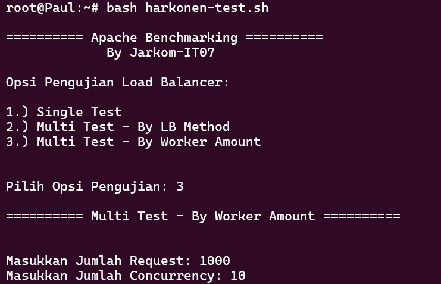

Kemudian didapat hasil seperti berikut

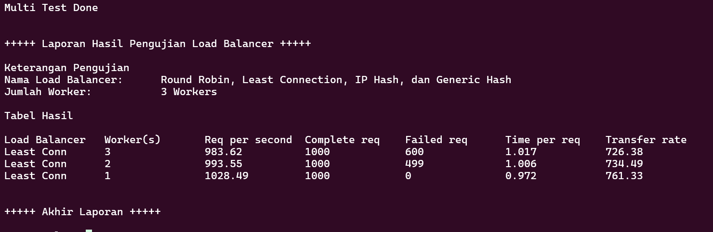

Hasil lengkapnya dapat diakses pada path `/root/report/`

Analisis kemudian dilakukan pada hasil tersebut untuk kemudian dibuat laporan yang dapat diakses melalui [link berikut]()

## No.10

### Menambahkan Konfigurasi pada Load Balancer

tambahkan konfigurasi auth_basic untuk mengatur autentikasi pada load balancer

- `/etc/nginx/sites-available/round_robbin_3w.conf`
```conf
location / {
            auth_basic "Super Secret - Do Not Pass";
            auth_basic_user_file /etc/nginx/supersecret/htpasswd;
            proxy_pass http://round_robin_3w;
            proxy_set_header    X-Real-IP $remote_addr;
            proxy_set_header    X-Forwarded-For $proxy_add_x_forwarded_for;
            proxy_set_header    Host $http_host;
        }
```

### Mengatur keperluan autentikasi

Install apache2-utils untuk menggunakan perintah `htpasswd`

```bash
apt-get install apache2-utils
```

Buat credential baru untuk username dan password sesuai dnegan permintaan soal yang kemudian akan disimpan pada file `/etc/nginx/supersecret/htpasswd`

```bash
htpasswd -bc /etc/nginx/supersecret/htpasswd secmart kcksit07
```

lakukan restart pada service nginx kemudian uji pada client

```bash
lynx 10.67.4.3:8000
```
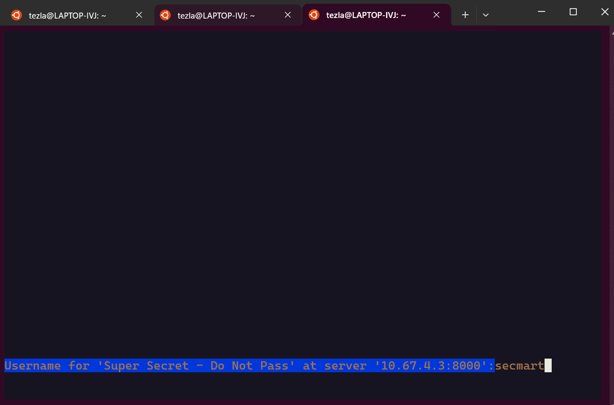

## No.11

### Menambahkan Konfigurasi pada Laod Balancer

Pada konfigurasi load balancer, buat pengaturan tambahan yang akan menghapus path `/dune` kemudian mengarahkannya kepada `https://www.dunemovie.com.au` diikuti dengan path yang mungkin ditambahkan setelah /dune

- `/etc/nginx/sites-available/round_robbin_3w.conf`
```
location ~ /dune {
            rewrite ^/dune(.*)$ /$1 break;
            proxy_pass https://www.dunemovie.com.au:443;
            break;
        }
```

Kemudian lakukan pengujian menggunakan lynx

```bash
lynx 10.67.4.3:8000/dune
```

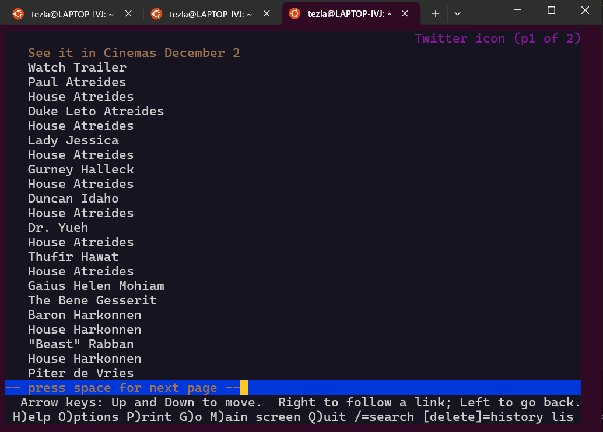

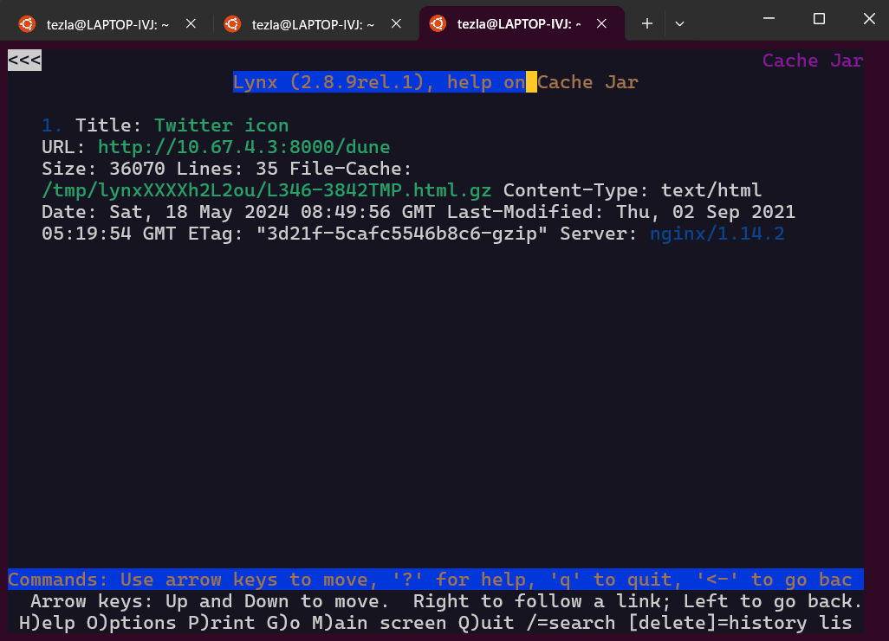

Proxy pass juga dapat meneruskan path yang diletakkan setelah `/dune`

```bash
lynx 10.67.4.3:8000/dune/characters
```

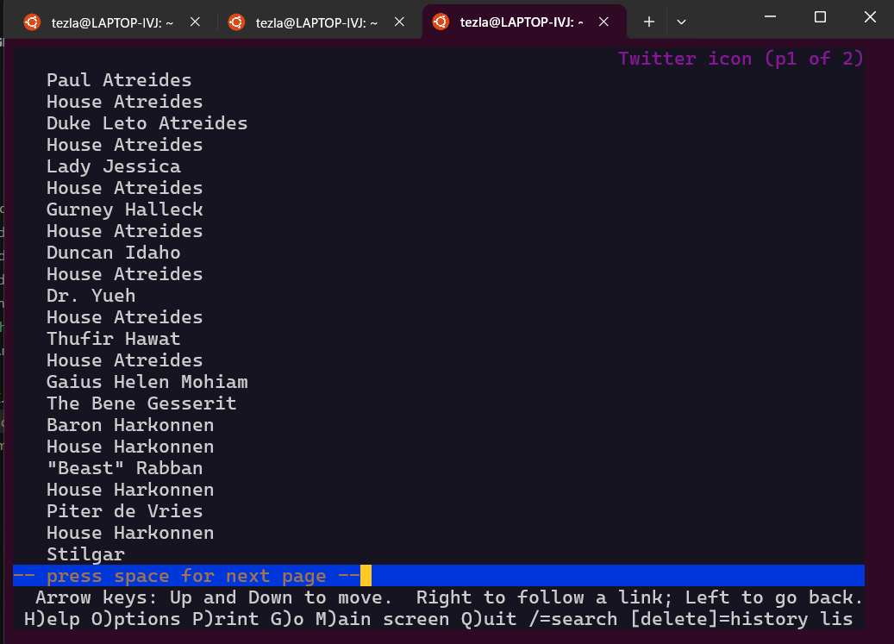

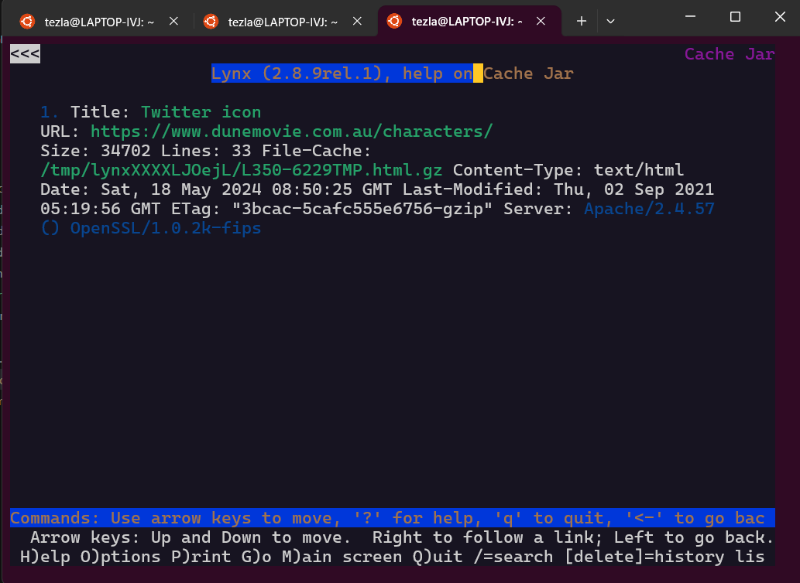

## No.12

### Menambahkan IP yang diizinkan

Tambahkan semua IP yang diizinkan soal pada config load balancer

- `/etc/nginx/sites-available/round_robbin_3w.conf`
```conf
location / {
    allow 10.67.1.37;
    allow 10.67.1.67;
    allow 10.67.2.203;
    allow 10.67.2.207;
    deny all;

    auth_basic "Super Secret - Do Not Pass";
    auth_basic_user_file /etc/nginx/supersecret/htpasswd;
    proxy_pass http://round_robin_3w;
    proxy_set_header    X-Real-IP $remote_addr;
    proxy_set_header    X-Forwarded-For $proxy_add_x_forwarded_for;
    proxy_set_header    Host $http_host;
}
```

Restart Nginx dan uji pada client

```bash
lynx 10.67.4.3:8000
```

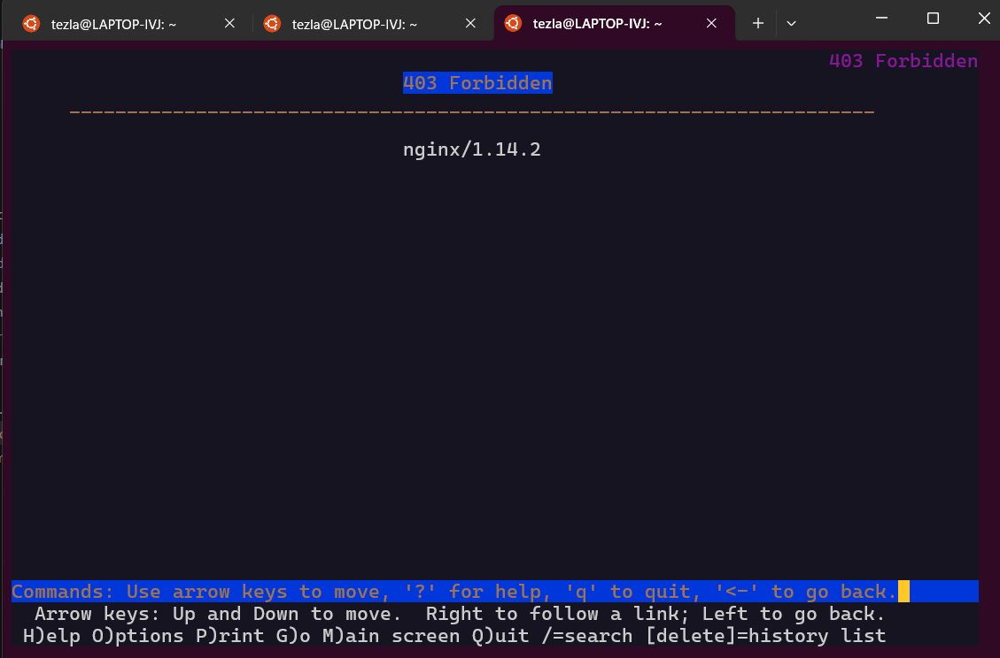

Client akan mendapatkan error kode `Forbidden` dari load balancer.

### Fix IP untuk Client

Atur Hwaddress pada kedua Client dengan menambahkan config tambahan pada node Paul dan Dmitri

- `Paul`
```conf
auto eth0
iface eth0 inet dhcp
hwaddress ether ea:bd:80:c5:98:e2
```

- `Dmitri`
```
auto eth0
iface eth0 inet dhcp
hwaddress ether 6e:51:8c:8a:93:d8
```

Berikan Fix IP untuk Paul dengan mengatur konfigurasi host Paul

- `/etc/dhcp/dhcpd.conf`
```conf
host Paul {
    hardware ethernet ea:bd:80:c5:98:e2;
    fixed-address 10.67.2.203;
    option host-name "Paul";
}
```

restart isc-dhcp-server kemudian restart juga client Paul bandingkan hasil aksesnya antara Paul dan Dmitri

- `Paul`
```bash
lynx 10.67.4.3:8000
```

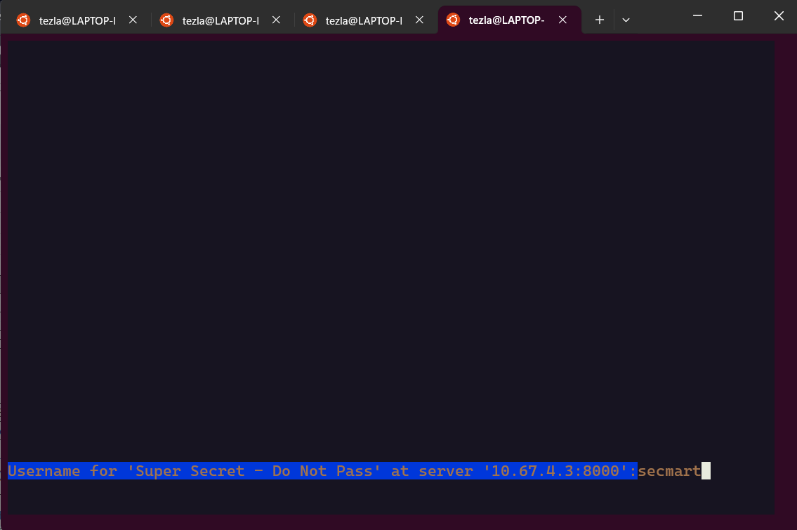

## No.13
## No.14
## No.15
## No.16
## No.17
## No.18
## No.19
## No.20
